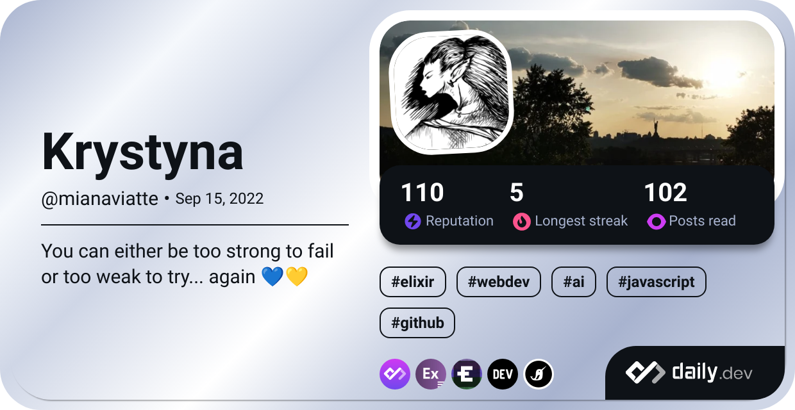

  <h1 style="width:100%;height:10%;text-align:center;position:relative;top:40%;">Junior Elixir Engineer</h1>

  
  
 

 

 

 

 

   
  
        
  👋 Hi, I’m [@Mianaviatte](https://www.instagram.com/mianaviatte/) for the public  

 ☕️ Female software engineer with  
  **C2 Proficient English** level  
     
  🩸 **Fallen in love with Elixir**  
  soon after completing  
  💎 Ruby on Rails  
  Web App Development  
  Scholarship with honors  
    
  😍 Loving mom, aspie & geek  
  😎 Passionate PC & mobile gamer  
  ❤️ Loving skyporn photo, hugs,  
  professionalism  

     

<!-- real time moon -->
  
 
 

      

  
 
<h2>I'm a Ukrainian female software developer</h2>
  

  💻 Pythoness in tech with Ruby lips on Rails of sanity brewing Elixir to summon Phoenix  
  🙏 Becoming an experienced and valuable asset in **remote** tech field after 10+ years in business fields  
  💎 Drilling into architecture, refactoring, databases & clean coding  
  

  

   
  
<!--- GitHub stats -->
<h2>Github & Daily.Dev Stats</h2>

  <picture>
    <source
      srcset="https://github-readme-stats.vercel.app/api?username=Mianaviatte&show_icons=true&theme=dark&hide_border=false&line_height=20"
      media="(prefers-color-scheme: dark)"
    />
    <source
      srcset="https://github-readme-stats.vercel.app/api?username=Mianaviatte&show_icons=true&hide_border=false&line_height=20"
      media="(prefers-color-scheme: light), (prefers-color-scheme: no-preference)"
    />
    
  </picture>
  
    

 <!--  -->
